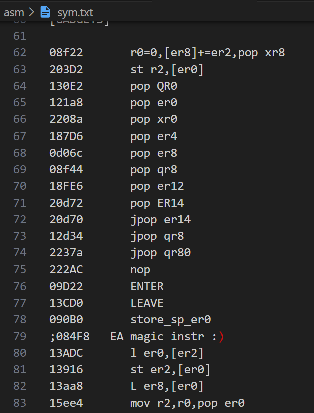
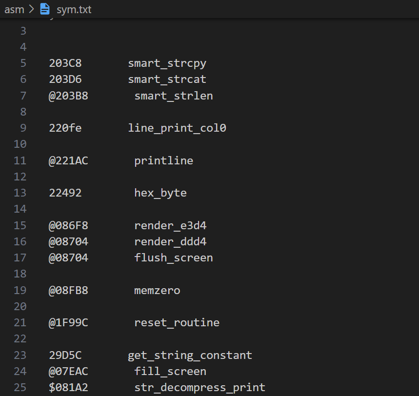
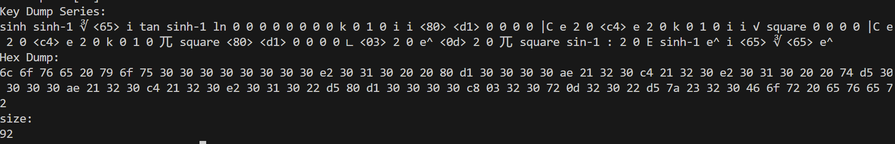

# 汇编器使用
--> [返回目录](../README.md)
## 运行环境
- python3.8+

## 使用
**以下所有操作在asm文件夹内进行**
1. 将你需要的gadget/函数放在sym.txt  
   我们已经为你准备了一些常用的函数表
   ### 预装gadget表
   
   
   ### 预装函数表
   

    以上只是部分，详情查看sym.txt  
    ### 添加函数/gadget
    命名规则：
    ```
    01234       xxxxx
    ```
    注意，空格数要严格一致！

## 一些写好的例子已经放在asm目录下
```
python3 ./asm.py test.asm
```
执行编译

会输出按键序列和16进制序列