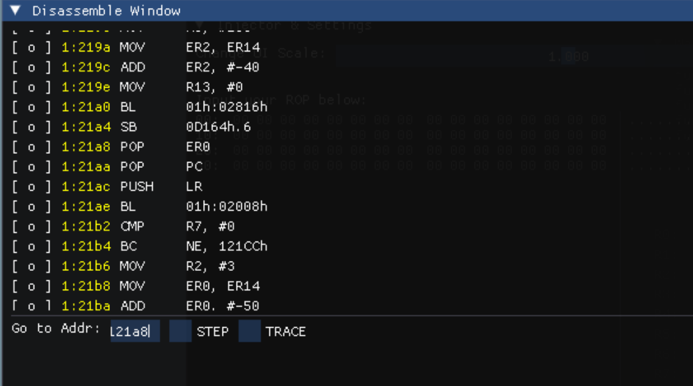
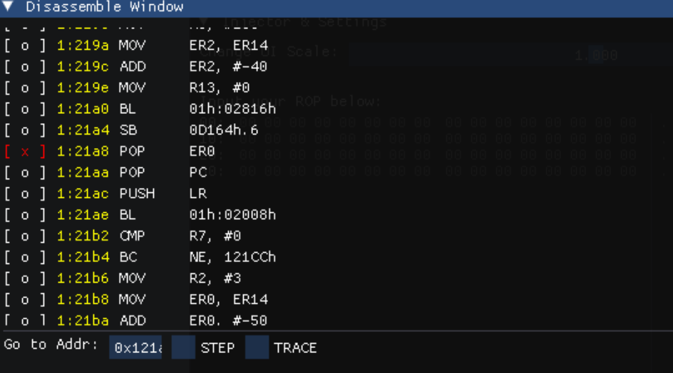
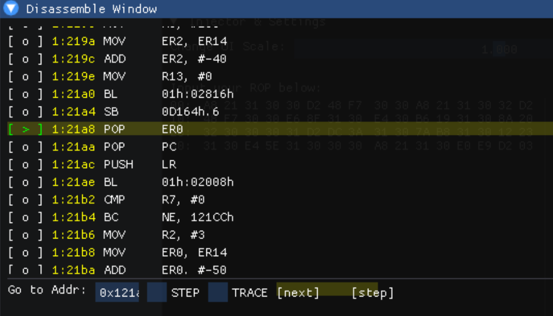
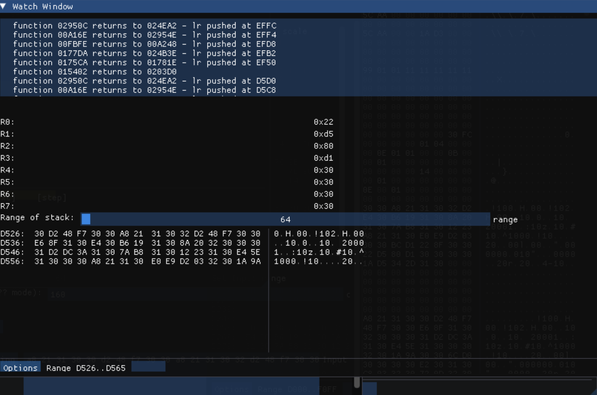

# ROP使用
--> [返回目录](../README.md)

## ROP注入
[rop输入教程](../README.md)

## ROP调试

1. 例如，你的程序是：
```
pop er0
hex 30 d2
read_key 
pop er0
hex 32 d2 
```
你想要查看read_key之后的效果  
那么，首先找到pop er0 对应的地址：**0x121a8** (sym.txt)  
在执行rop 之前，

在disas窗口定位这个地址  
点击左侧 **[ o ]**

等到变成红色的 **[ x ]**  
然后执行rop

断点触发  
- step 单步执行
- next 继续
- trace 每次pop pc或ret 触发断点(可以用于跟踪rop chain)  

寄存器值窗口
