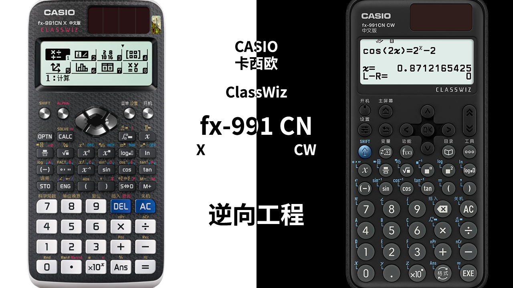

## 简介

这是一个整理 Casio CW i 代和 CW ii 代机型研究的存储库。

## 目录

本仓库目前包含以下内容（点击链接查看对应部分的详细说明）：

* [反编译相关](反编译相关)：使用 Ghidra 反编译计算器 ROM，及计算器所用的 nX-U8 型号 CPU 的资源；
* [模拟器及资源](模拟器及资源)：真机模拟器与 ROM、字体与字符表等；
* [ROP](ROP)：ROP 教程以及部分函数说明。

## 下载所有内容

请遵循以下步骤获取这个仓库的所有内容到你的电脑上。

0. 安装 [Git](https://git-scm.com/)；
1. 选一个合适的位置，执行

       git clone https://github.com/Physics365/991CN-X-CW-Decompilation.git --recursive
2. 从@qiufuyu123 的[云盘](https://casio.123a.club/)或专门的[LFS仓库](https://github.com/Physics365/991CN-X-CW-Decompilation_Files)下载你所需的LFS文件

3. 完事。

## 致谢/参考

* [百度贴吧 fx-es(ms)吧](https://tieba.baidu.com/fx-es(ms))：故事的开始
* [Universal Casio Forum](https://casiocalc.org)：卡西欧计算器论坛
* [CASIO calculators exploits](https://casiocalc.wikidot.com)：卡西欧计算器漏洞利用
* 百度贴吧用户 [@EwTE_H](https://tieba.baidu.com/home/main?id=tb.1.ba0c2f47.avRm7aRqck4QgwYYgIf3eA&fr=pb&ie=utf-8)：适用于 Ghidra 的 nX-U8 语言。
