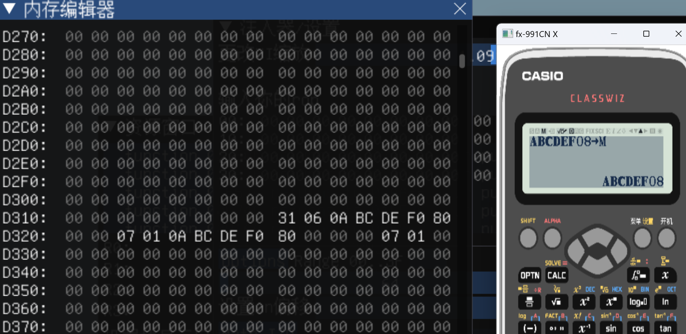

# 数据持久化


## 原理
计算器RAM **0xe9e0~???** 的数据关机时不会清除

## 思路
将拼字用到的数据依次拷贝到 0xe9e0 后的某段区域  
以后每次要拼字，直接pop er2到这个地址，然后printline即可  
省去了每次构造字符串的过程

## 实现
### 准备工作
- **首先** 我们排除直接使用strcpy/smart_cpy一类的函数来完成这个操作（过于繁琐，如果不可见字符比较多，复制一次很耗时）
- 我们想要的效果是：
    - 类似使用刷不可见字符的方法，直接输入字符的16进制代码：
    ```
    记得这个吗？
    x:@=1.00006523
    ```
    我们希望实现类似的效果，人工输入字符对应的16进制编码，例如：  
    6 5 --> Neg( 即可完成数据拷贝  
- **实现** 
    - 仍然基于变量赋值的特性：  
    我们观察到：  
    0-9,A-F 被存储为ascii码的格式(30-3f)
    
    - 当进行变量赋值时:  
    
    例如这里，赋值给M变量  
    M变量的存储方式比较特别:  
    ```
    [3a][3b][3c][3d][3e][3f][30][38]
    v v v v v v v v v v v v v v v v
    [0a]  [bc]    [de]    [f0]    [8]
    ```
    他会把ascii码高低位拆开，然后错位重组  
    ```
    [36] [35]
     v   v  v
    [65]
    ```
    利用这个特性，我们可以手动输入16进制代码，赋值给变量，然后通过拷贝变量存储的数据，完成16进制代码到单字节字符的转换  
    ```
    例子：
    假设我们要拼love这个单词，查表可得:
    4c 4f 56 45
    我们可以把：
    (33)34 3c 34 3f 35 36 34 35 赋值给变量(M),这里多打一个33为了占位(03)
    ```
    
    - 赋值后，查看变量M存储的位置(0xd31a)
    
    观察到，目标数据
    ```
    4c 4f 56 45
    ```
    已经写入
    
    - 当然，我们一次只能写入6个bytes
    变量最长可以存储8bytes
    第一位我们不用，因为是[0]开始的：
    ```
    33 34 35
     v v v
    [03] [45]
    ```
    最后一位我们也不用，因为strcpy需要NUL字符来控制长度  
    所以8-1-1=6
    - 至此我们完成了准备工作：16进制ascii转单字节字符
### ROP
接下来完成拷贝ROP的编写。  
这里比较简单，只要调用一次strcpy(0xe090+,0xd31b)即可  
- [代码](./data.asm)

### 操作流程：
1. 写出你要持久化的数据的16进制编码：
```
例子：
6c 6f 76 65 20 79 6f 75 ; `love you`
20 20 20 20 20 20 20 20 20 ;9个空格
```
2. 拆分为6bytes为一组
3. 逐组进行以下操作：
- 拆分16进制:
```
6c 6f 76 65
 v v v v 
(3[占位，任意数字]) c 6 f 7 6 6 5
```
- **一定**要先进入110an后再继续如下操作！！！！不然变量会被覆盖
- 打出来（16进制字符用字符转换器刷出)
- 赋值给M变量
- [AC]
- 打出ROP
- [=]
- 注意，此时计算器会"卡死"，但是事实上rop已经执行成功
- 重复以上步骤，直到所有字节都复制完毕(注意每次rop里目标地址都要+6)

模拟器可以观察到数据写入情况

## 使用你持久化的数据
- [代码](./data_print.asm)
